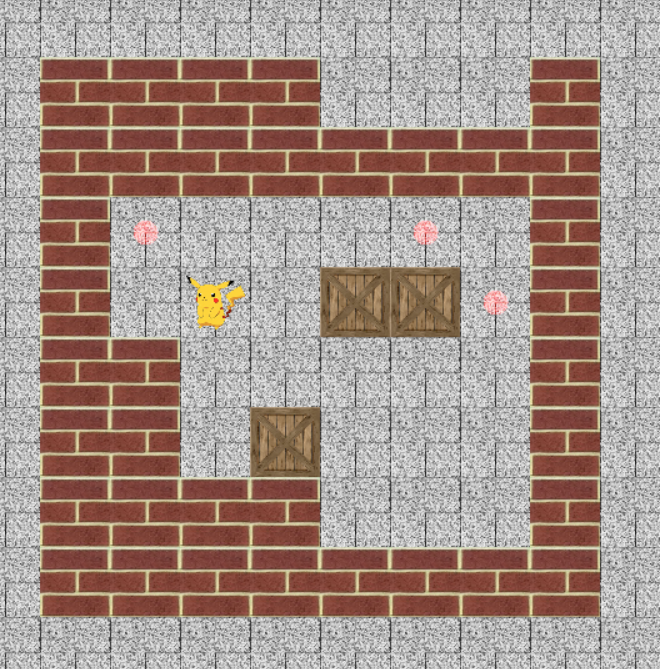
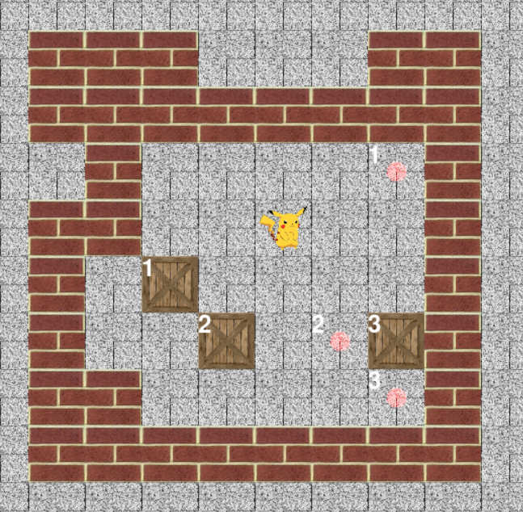

# Sokoban (推箱子) Game and Auto-Solving

This repository contains the midterm project for the "Principles of Artificial Intelligence" course offered by the Department of Automation at Tsinghua University. The project focuses on the implementation of a Sokoban game, covering three main components: UI design, map generation, and automatic solving.





## Running the Program and UI Usage

There are 3 code files in this directory. `game_runner.py` contains the main function for program execution, and the `game_runner` class defined therein is the high-level controller of the program. `utils.py` contains the map class (`numeral_map`) and state class (`state`) used for game execution and searching algorithm solving. `map_maker.py` defines the random map generator (`map_maker` class).

To run the program, execute `game_runner.py`, which depends on the `pygame` library. You can install it with:

```bash
pip install pygame
```

Due to time constraints, I did not add control interfaces in the UI; all setting interfaces are located in the initialization of the `game_runner` object as shown in lines `232-234` of `game_runner.py`. The initialization parameters include:

- `random`: `True` for randomly generated maps, `False` to use maps from the map library (`map_list.py`). Default is `True`.
- `mode`: `mode=1` indicates that boxes will not disappear after being pushed into holes (they can be pushed out again), and there is no one-to-one correspondence between boxes and holes; `mode=2` indicates that boxes will disappear after being pushed into holes, and there is a one-to-one correspondence between boxes and holes. Default is `1`.
- `player`: `"auto"` for automatic solving by the program, `"human"` for player-controlled gameplay (use arrow keys to move the character, press R to restart). Default is `"auto"`.
- `level`: Only used for `random=False`, specifies the index of the map in the map library. Default is `0`.

## Generation of Initial Scenes

I implemented an algorithm in `map_maker.py` to randomly generate $8\times 8$ Sokoban maps. The specific steps are as follows:

1. Initialize all positions as empty.
2. Arrange walls in the outer 2 layers of positions. There is a certain probability of jumping between these two layers during wall extension.
3. Randomly generate target positions, box positions, and character position.
4. Check if the map is solvable; if not, generate randomly.

In the step "Check if the map is solvable," I initially used the A* algorithm implemented later (described below) to solve the Sokoban game automatically. However, due to the high probability of unsolvable randomly generated maps, this method was not efficient. Later, I implemented a method that only checks solvability. The idea is to determine if a box can be pushed to a target position based on the arrangement of walls around the box and its row and column adjacent to the walls. This algorithm can efficiently filter out thousands of unsolvable maps in less than 1 second, greatly improving the efficiency of randomly generating solvable maps. Although this algorithm still has a very low probability of generating unsolvable maps, in such cases, the search algorithm can provide a "unsolvable" result.

## Searching Algorithm

I used the A* algorithm (the main body of the algorithm is in `utils.py`, and the calling interface is in `game_runner.py`). The idea is as follows:

- State (`state` class) represents the current map at a given time. When determining whether two states are equal, only the positions of the boxes and the character need to be completely equal.
- The cost function is the number of steps multiplied by `0.1` (through experimentation, a cost of `1` per step would lead to the algorithm traversing a large number of states, resulting in lower efficiency; a cost of `0.1` per step can achieve better results on the basis of quick solving, but often not the optimal solution).
- The heuristic function is the minimum value of the Manhattan distance between all boxes and all target positions in the scene.
- When the open node list is empty or the maximum number of iterations is reached (set to $10^8$ here), the algorithm returns "no solution."

## Box Disappears After Being Pushed into Holes and Correspondence with Holes

The algorithm described above assumes that boxes will not disappear after being pushed into holes (they can be pushed out again), and there is no one-to-one correspondence between boxes and holes. For the scenario where boxes disappear after being pushed into holes and have a one-to-one correspondence with holes, the solution will not change significantly. The adjustments made are as follows:

- When generating random maps, generate target position tables and box position tables simultaneously, and the boxes and corresponding target positions have a one-to-one correspondence.
- In the Sokoban game program, modify the relevant interfaces so that boxes disappear when they reach the corresponding target positions (I also let the target positions disappear together because they no longer serve any purpose). The victory condition in the program does not need to be changed; it is set to "no boxes in the scene" (in the previous question, the program also treats "boxes" and "boxes that reach the target positions" as two entities).
- Modify the heuristic function of the A* algorithm to be the sum of the Manhattan distances from each box to its corresponding target position.

After making the above adjustments, the previous algorithm was successfully transplanted to this new scenario.
